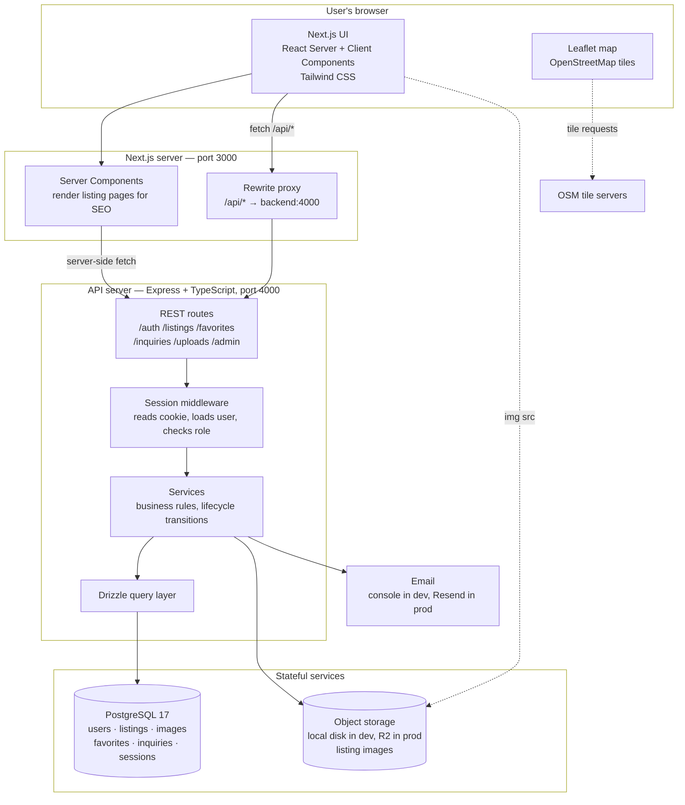

# ARCHITECTURE — Real Estate Listing App

**Status:** approved 2026-08-20. Nothing is scaffolded yet.

Decisions confirmed by Haris: Express + TypeScript, REST, Drizzle, sessions in
Postgres, **no PostGIS**, and no extra local containers (§6). Sections below
reflect those answers.
Companion to `SPEC.md`, which defines *what* we're building; this defines *how*.

---

## 0. The one idea behind all of this

We are building a small app on a deliberately full-sized architecture. Every
choice below is made twice: once for what a ~500-listing site actually needs,
and once for what teaches the most. Where those disagree, this document says
so out loud rather than pretending the technical case was obvious.

That honesty matters later. When you interview on this project, "we kept
sessions in Postgres because JWTs can't be revoked and we only run one API
server" is a strong answer. "We used JWTs because that's what everyone uses"
is not. §4.1 below is a worked example of the same discipline in the other
direction — a proposal that didn't survive its own tradeoff.

---

## 1. System overview



Read it as four layers: the browser, a Next.js server that renders HTML, an
Express API that owns all business rules and is the only thing that talks to
the database, and the stateful services behind it.

The important structural rule: **the browser never talks to Postgres, and the
Next.js server never talks to Postgres either.** Every read and write goes
through the API. That's slower than letting Next.js query the DB directly, and
it is the entire point — it gives you one place where authorization lives, one
place where "only PUBLISHED listings are public" is enforced, and a backend you
could put a mobile app in front of tomorrow without moving a line of logic.

---

## 2. Frontend — Next.js (App Router) + TypeScript + Tailwind

**Recommended, and it's the easy call.** Listing detail pages have to be
server-rendered — a property site that renders client-side is invisible to
Google, and organic search is how a listings site gets traffic. The App
Router's Server Components render those pages on the server by default.

You're already strong here, so the learning budget goes elsewhere.

Notable frontend decisions:

- **URL is the source of truth for search state.** Filters live in the query
  string (`?town=bugojno&priceMax=150000&beds=2`), not in React state. A search
  becomes shareable, bookmarkable, and back-button-correct for free, and the
  server can render the filtered page directly.
- **The map is a Client Component, lazy-loaded.** Leaflet touches `window` and
  can't server-render. Keeping it isolated means the rest of the page still
  renders on the server.

---

## 3. Backend — Express + TypeScript, REST

### 3.1 Express + TypeScript over FastAPI

`CLAUDE.md` left this open. **I recommend Express with TypeScript**, for one
reason that outweighs the rest: it keeps the whole project in one language.

The thing you're here to learn is backend *concepts* — how a request is
authenticated, how a session is stored, how a migration works, how a query is
planned. If the backend is Python, you spend part of your 1–2 hours a day
learning Python's idioms, its packaging, its async model, and its type system
alongside those concepts. That's a second learning curve stacked on the one
that matters.

One language also means `/shared` can hold TypeScript types used by *both*
sides — so if you rename a field on the listing model, the frontend fails to
compile. Cross-language, that guarantee doesn't exist.

The honest counterpoint: FastAPI is a genuinely nicer framework than Express.
It has request validation, dependency injection and auto-generated API docs
built in, where Express gives you almost nothing and you assemble it yourself.
But "you assemble it yourself" is also a teaching mechanism — you'll see what
each piece does because you added it.

### 3.2 REST, not GraphQL

GraphQL earns its complexity when many different clients need different shapes
of a deeply nested data graph, and over-fetching is a real cost. We have one
client and a shallow model: a listing has images, a user has favorites. That's
it.

REST also *is* HTTP. Learning it teaches you status codes, verbs, caching
headers, and idempotency — the foundations everything else is built on,
GraphQL included. Learning GraphQL first means learning a layer that hides
those foundations from you.

Route layout follows `CLAUDE.md` — one file per resource under
`/backend/src/routes`:

```
POST   /api/auth/register      POST   /api/auth/login      POST /api/auth/logout
GET    /api/auth/me

GET    /api/listings           # public, filtered, paginated
GET    /api/listings/:id       # public if PUBLISHED, owner/admin otherwise
POST   /api/listings           # seller
PATCH  /api/listings/:id       # owner or admin
DELETE /api/listings/:id       # owner or admin
POST   /api/listings/:id/submit  # DRAFT → PENDING

GET    /api/favorites          POST /api/favorites/:listingId   DELETE /api/favorites/:listingId
POST   /api/listings/:id/inquiries

POST   /api/listings/:id/images    DELETE /api/images/:id    PATCH /api/images/:id  # reorder/cover

GET    /api/admin/listings?status=PENDING
POST   /api/admin/listings/:id/approve   # records offline payment + sets expiry
POST   /api/admin/listings/:id/reject    # with reason
```

### 3.3 Layers inside the API

`routes → services → data access`. Routes parse and validate input and shape
the HTTP response; services hold the rules ("a listing can only go PENDING →
PUBLISHED, and only an admin can do it"); the data layer talks to Postgres.

This split is the difference between an app you can test and one you can't. A
lifecycle rule sitting in a service function can be unit-tested in
milliseconds; the same rule written inline in a route handler can only be
tested by making an HTTP request.

---

## 4. Database — PostgreSQL 17

Postgres is the right call and needs little defence: relational data with real
relationships, transactions when approving a listing has to write two tables at
once, and full-text search built in.

### 4.1 On PostGIS — proposed, and declined

**Decision: no PostGIS. Two `double precision` columns, `lat` and `lng`.**

I proposed PostGIS on learning grounds and Haris declined it. That's the
technically correct answer, so it needs no apology: at 500 rows Postgres reads
the entire table in well under a millisecond, and no spatial index can improve
on "instant".

What we do instead:

```sql
-- Listings inside the current map viewport — a plain bounding box
WHERE lat BETWEEN :south AND :north
  AND lng BETWEEN :west  AND :east

-- Listings near a town centre: filter to a generous box first,
-- then sort by true distance over the handful of rows that survive
ORDER BY (lat - :lat)^2 + (lng - :lng)^2
```

The second one is worth understanding, because it's a trick that keeps
appearing. Sorting by *squared* distance gives the same ordering as sorting by
distance — the square root is monotonic — so we skip the trigonometry
entirely for a nearest-first sort. It's only wrong if we need to *display* the
distance in kilometres or filter on an exact radius; at that point we add the
haversine formula in one SQL expression, over an already-tiny result set.

What we give up: an exact "within 10 km" filter reads as arithmetic rather
than `ST_DWithin(...)`, and the degrees-to-kilometres conversion is
latitude-dependent (at ~44°N, one degree of longitude is about 80 km against
111 km for latitude). Our bounding box compensates by padding the longitude
span. Confined to seven towns in one small region, this is a fixed constant,
not a real problem.

**This stays reversible.** Adding PostGIS later is one migration: enable the
extension, add a generated `geom` column from `lat`/`lng`, build a GiST index.
The trigger to revisit would be needing genuine radius search over a much
larger area — not a hunch.

### 4.2 Drizzle for queries and migrations

Three options, and the choice is really about how much SQL you see.

| | What you write | What you learn |
|---|---|---|
| **Raw SQL + a migration tool** | Every query by hand, plus row→object mapping | The most — and you'd spend the 12 weeks writing mapping code |
| **Prisma** | Prisma's own schema DSL and query API | The least — it hides SQL behind an abstraction with its own vocabulary |
| **Drizzle** | TypeScript that mirrors SQL 1:1 | Nearly all of it, without the boilerplate |

**Recommended: Drizzle.** `db.select().from(listings).where(eq(listings.status, 'PUBLISHED'))`
maps directly onto the SQL it generates — you can read one and predict the
other, which means you're learning SQL while using an ORM. Its migration tool
generates plain `.sql` files you can open, read, and edit, satisfying the
`CLAUDE.md` rule that schema changes happen only via migrations.

It also has a clean escape hatch to raw SQL (`sql\`...\``) for the cases an
ORM expresses badly — the distance sort in §4.1 is exactly one of those.

With PostGIS out, the case against Prisma is purely the learning one above.
Prisma is a fine tool and you'd ship faster with it; you'd just see less SQL
while doing it. That's the whole tradeoff, honestly stated.

### 4.3 Schema sketch

Settled properly in Phase 3, but the shape:

```
users        id, email, password_hash, name, phone,
             is_seller, is_admin, created_at
sessions     id, user_id, expires_at, created_at
listings     id, owner_id, status, title, description, price, currency,
             property_type, transaction_type, size_m2, rooms, bedrooms,
             bathrooms, floor, year_built, town, neighbourhood, address,
             lat, lng, contact_*, search_vector,
             published_at, expires_at, sold_at, created_at, updated_at
images       id, listing_id, storage_key, width, height, position, is_cover
favorites    user_id, listing_id, created_at        (composite PK)
inquiries    id, listing_id, name, email, phone, message, created_at, ip
payments     id, listing_id, admin_id, amount, method, paid_at, note
```

`payments` is separate from `listings` rather than a few columns on it,
because a renewed listing gets a second payment. One row per payment keeps that
history intact.

---

## 5. Auth — server-side sessions in Postgres, not JWTs

### 5.1 The recommendation

Email + password, hashed with **argon2id**. On login the API creates a row in
`sessions` and returns an opaque session ID in an **HttpOnly, Secure,
SameSite=Lax cookie**. Every subsequent request carries the cookie; middleware
looks the session up, loads the user, and attaches it to the request.

### 5.2 Why not JWTs

JWTs are the default answer online, and they're usually the wrong one for an
app like this.

The pitch is statelessness: the token itself contains the user's identity and
is signed, so the server needn't store anything or hit the database. The
problem is that you can't take one back. Ban a user, change their role, or have
them log out on a stolen laptop, and their token stays valid until it expires.
The standard fix is a server-side list of revoked tokens — at which point you
are checking the database on every request, and you've built a session table
with extra steps and worse ergonomics.

The statelessness benefit is real when you have many API servers and want to
avoid a shared session store. We will have one. We're paying a real cost for a
benefit we can't collect.

Sessions in Postgres: revocation is `DELETE FROM sessions`. Role changes take
effect on the next request. The cookie is opaque, so nothing leaks if it's
read. And you'll understand what a session *is*, which is the more fundamental
concept — JWTs make more sense afterwards, not before.

### 5.3 The cookie problem, and the proxy that solves it

Cookies are bound to an origin. Frontend on `localhost:3000` and API on
`localhost:4000` are different origins, so the cookie won't be sent without
CORS credentials, an explicit origin allowlist, `SameSite=None`, and in
production a shared parent domain. That's a well-known source of hours lost to
debugging.

Instead: **Next.js rewrites `/api/*` to the backend.** The browser only ever
sees `yoursite.com/api/...` — one origin, no CORS, no `SameSite` gymnastics,
and the API needn't be publicly exposed at all.

```mermaid
sequenceDiagram
    participant B as Browser
    participant N as Next.js :3000
    participant A as Express API :4000
    participant D as Postgres

    B->>N: POST /api/auth/login {email, password}
    N->>A: proxied to :4000/api/auth/login
    A->>D: SELECT * FROM users WHERE email = $1
    D-->>A: user row (with password_hash)
    A->>A: argon2.verify(hash, password)
    Note over A: constant-time compare;<br/>same generic error either way
    A->>D: INSERT INTO sessions (user_id, expires_at)
    D-->>A: session id
    A-->>N: 200 + Set-Cookie: sid=…; HttpOnly; SameSite=Lax
    N-->>B: cookie stored by browser

    Note over B,D: every later request
    B->>N: GET /api/favorites (cookie sent automatically)
    N->>A: proxied, cookie forwarded
    A->>D: SELECT … FROM sessions JOIN users WHERE sid = $1
    D-->>A: user + role flags
    A->>A: authorize, then handle
```

That diagram is your Day 6 exercise, pre-drawn. When you can narrate it
without looking, you understand web auth.

### 5.4 Authorization

Two role flags (`is_seller`, `is_admin`) on the user, checked by middleware.
Three levels: public, authenticated, admin — plus ownership checks in services
(`listing.owner_id === user.id`). Ownership is checked at the data layer, never
by hiding a button in the UI.

Middleware separates two questions that are easy to conflate. `loadUser` runs
on every `/api` request and only answers *who is this, if anyone* — it never
rejects. `requireAuth` and `requireAdmin` are per-route guards that answer *is
that good enough*. Keeping them apart means a public route can still
personalise itself (showing which listings you have favourited) without special
casing, and it puts the authorization decision in the route definition, where a
missing one is visible during review.

**Registration is role-neutral.** Signing up does not ask whether you intend to
buy or sell, and creates a user with both flags false. `is_seller` is set
automatically the first time someone creates a listing (Phase 4.2). The
alternative — a "what kind of account?" question at signup — asks people to
commit before they know, and produces a flag that records an intention rather
than a fact. Easy to reverse: it is one checkbox on the form and one line in
the register handler if we ever want it.

`is_admin` is never settable through the API at all. It is granted by hand in
the database.

---

## 6. Images — a storage adapter, disk in dev and R2 in production

**Decision: no MinIO container. Local dev writes files to disk; production
writes to Cloudflare R2.**

I proposed running MinIO locally so dev and production would use an identical
code path, and Haris declined the extra containers. That's a reasonable call
for a machine you develop on daily — but it does create the risk I named:
code that works locally and fails on deploy. So the design has to absorb it.

### 6.1 The adapter

Storage sits behind one small interface, with two implementations:

```ts
interface StorageAdapter {
  put(key: string, body: Buffer, contentType: string): Promise<void>
  delete(key: string): Promise<void>
  urlFor(key: string): string
}
```

- `DiskStorage` — writes under `/backend/uploads`, served by Express as static
  files. Used when `STORAGE_DRIVER=disk`.
- `R2Storage` — the same three methods via `@aws-sdk/client-s3`. Used when
  `STORAGE_DRIVER=s3`.

Everything else in the app — upload routes, the admin panel, deletion when a
listing is removed — only ever sees `StorageAdapter`. Nothing above this line
knows which one is running.

This is the ports-and-adapters idea, and it's worth recognising because it
recurs everywhere: **isolate the thing that varies behind an interface, so the
variation lives in exactly one file.** It's also our insurance here. The
divergence between dev and prod is confined to two small classes, rather than
smeared across every route that touches an image.

### 6.2 What to actually watch for on deploy day

Because dev and prod differ, these are the failure modes — worth reading again
when you hit Phase 6:

1. **Disk on a container host is ephemeral.** Render and Railway wipe the
   filesystem on every deploy and restart. If `STORAGE_DRIVER` is ever wrong in
   production, uploads appear to work and then silently vanish. The app should
   **refuse to start** in production with `STORAGE_DRIVER=disk` — a loud crash
   beats losing users' photos.
2. **URL shape differs.** Disk gives `/uploads/abc.jpg`, R2 gives a full
   `https://…` URL. Always render `urlFor(key)`; never build image URLs by
   string concatenation in the frontend.
3. **CORS on the bucket** must allow your frontend origin, or images 404 in the
   browser while working perfectly from `curl`.

### 6.3 Upload flow

Browser → API → storage, **one file per request, raw bytes as the body**.

No `multipart/form-data`, and therefore no `multer`. Express does not parse
multipart, and before adding a dependency for it the question is what multipart
buys us: several files plus text fields in one request. We need neither. There
are no text fields, and one request per file is better behaviour anyway — each
photo gets its own error, and a failure on the fourth image does not discard
the first three. `fetch(url, { method: 'POST', body: file })` posts a File
directly, so the server side is `express.raw` and a Content-Type check. If
batching ever becomes worth it, multer is the right tool and that is the moment
to ask.

The pipeline, in order, with the reason for each step:

1. **Size and type refused before decoding.** A "decompression bomb" is a small
   file that expands into gigabytes of pixels; the cheapest defence is not
   decoding anything large. `limitInputPixels` is the second line.
2. **sharp decodes the bytes.** The Content-Type header is a claim, not a fact —
   anyone can post a zip labelled `image/jpeg`. Decoding is what establishes
   this is really an image, so a failure is a 400, not a 500.
3. **`.rotate()` with no argument**, which applies the EXIF orientation flag.
   Phone cameras store the sensor image unrotated and record "actually
   portrait" in EXIF. Skip this and every vertical photo appears on its side —
   the most common image bug in web apps.
4. **Metadata dropped on output**, which sharp does by default. Phone EXIF
   routinely carries the GPS coordinates where the photo was taken. Publishing
   those next to a property listing hands out the seller's exact location, and
   often their home address, with nobody intending it. This is a privacy
   default worth being deliberate about rather than inheriting by luck.
5. **Two WebP variants** — 1600px for the gallery, 480px for cards — written
   through the storage adapter, then one `images` row. Output dimensions come
   from the encoder, not the input: `fit: 'inside'` preserves aspect ratio and
   rotation may have swapped the axes, so the input's numbers would give the
   page a wrong aspect ratio and make it jump as images load.

**On delete, the row goes first and the files after**, with file failures
logged rather than thrown. Fail that way round and the worst case is orphaned
bytes nobody can reach; the other way round, a live listing shows a broken
image. Given the choice, waste the bytes.

Adding or removing a photo **returns a published listing to PENDING**, because
the Phase 4.2 rule exempts only `price` and swapping the pictures on an
approved listing is exactly the bait-and-switch that rule exists to stop.

The more scalable pattern is a **presigned URL**, where the browser uploads
straight to the bucket and your Node process never touches the bytes. Right at
volume, wrong now — more moving parts, awkward server-side validation and
resizing, and it does not work with the disk driver at all. Revisit if uploads
visibly tie up the API.

### 6.4 Email, same shape

Identical treatment: a `Mailer` interface with `ConsoleMailer` (dev — prints
the rendered email to stdout) and `ResendMailer` (production). Same warning
applies: you won't see a real rendered email until you deploy, so send yourself
a test inquiry as the first thing you do in production.

## 7. Search — plain PostgreSQL, no search engine

**Elasticsearch is not needed and would be a mistake here.** It's a second
database to run, keep in sync, back up, and reason about when it disagrees with
Postgres. It earns that at millions of documents. We have hundreds.

### 7.1 Structured filters

Every filter in `SPEC.md` §4.3 is a `WHERE` clause:

```sql
SELECT * FROM listings
WHERE status = 'PUBLISHED'
  AND (:town::text IS NULL OR town = :town)
  AND (:priceMin::int IS NULL OR price >= :priceMin)
  AND (:priceMax::int IS NULL OR price <= :priceMax)
  AND (:beds::int IS NULL OR bedrooms >= :beds)
  AND (:type::text IS NULL OR property_type = :type)
ORDER BY published_at DESC
LIMIT 24 OFFSET :offset;
```

Indexes to start with:

```sql
CREATE INDEX ON listings (status, published_at DESC);   -- the default listing page
CREATE INDEX ON listings (status, town, price);         -- the common filter combo
CREATE INDEX ON listings USING GIN (search_vector);     -- keyword
CREATE INDEX ON listings (status, lat, lng);            -- map viewport
```

The leading `status` column on the first two is deliberate: *every* public
query filters on it, so it belongs at the front of the index.

### 7.2 Keyword search, and a Bosnian-specific wrinkle

**Built in migration 0002.** A `GENERATED ALWAYS AS ... STORED` tsvector column
over title, description and neighbourhood, with a GIN index. Generated means
Postgres recomputes it on every write, so it cannot drift from the text it
summarises — unlike a column maintained by application code, which is correct
until the first script or migration that touches `title` directly.

Two wrinkles, both specific to this language:

**No stemming.** Postgres ships no Bosnian/Croatian/Serbian dictionary, so the
config is `'simple'` — lowercase and split on whitespace. English stemming on
Bosnian text is worse than none.

**Diacritics.** Someone typing "kuca" must match "kuća", because the phone
keyboards most buyers use do not produce č, ć, š, ž or đ by default. Without
this, search appears to work for whoever built it and silently fails for
everyone else. The `unaccent` extension handles it — but Postgres refuses to
index `unaccent()` directly, because the extension's function is only STABLE:
it reads a dictionary that could in principle be swapped, which would silently
invalidate the index. The accepted fix is a wrapper declared IMMUTABLE around
the two-argument form, which names the dictionary explicitly:

```sql
CREATE FUNCTION f_unaccent(text) RETURNS text
  LANGUAGE sql IMMUTABLE PARALLEL SAFE STRICT
AS $$ SELECT public.unaccent('public.unaccent', $1) $$;
```

That is a promise not to change the dictionary underneath it. If anyone ever
does, the index must be rebuilt. It is applied to both the indexed text and
the search term — stripping accents on only one side matches nothing.

Since drizzle-kit cannot know the function must exist first, migration 0002 was
**hand-edited after generation** to create the extension and the function above
the generated `ALTER TABLE`. That is the workflow `generate` and `migrate`
being separate steps exists to allow.

`pg_trgm` for typo-tolerance is a later addition if searches come back empty
too often.

### 7.4 The map, and where its tiles come from

**Leaflet with OpenStreetMap's own tiles.** No API key, no billing account, no
per-request quota — which is why no map service appears in the dependency list
alongside R2 and Resend.

Three things worth recording:

**The map is the reason there is no geocoding service.** Sellers place their
listing by clicking the map, so nothing ever has to turn an address into
coordinates. That avoids a paid dependency, and it is also more accurate here:
addresses in small Bosnian towns geocode badly, while the person selling the
house knows exactly where it is.

**Markers are `divIcon`s, not images.** Leaflet's default marker is a PNG whose
URL it assembles at runtime, which bundlers rewrite — the famous broken-image
bug, usually patched by re-pointing Leaflet at the right files. A `divIcon` is
just HTML, so the problem never arises, and it lets each marker show its price,
which is the most useful thing a property pin can do.

**The map is client-only.** Leaflet touches `window` while measuring its
container, so it is loaded with `next/dynamic` and `ssr: false` behind a thin
Client Component boundary. Pages stay Server Components; the map is the single
island that is not. It is therefore invisible to search engines — fine, since
listing pages carry the SEO and nobody finds property by indexing a map tile.

**Tile usage policy — the one thing to watch before launch.** OSM's tiles are
donated infrastructure, and their usage policy asks that heavy or commercial
use move to a proper provider. At this site's traffic we are comfortably
inside what it permits. The trigger to switch is real traffic growth or any
commercial framing of the site; MapTiler and Stadia both have free tiers that
cover a site this size, and switching is a one-line URL change in
`LeafletMap.tsx` plus an attribution update. Flagged again in the
pre-production list.

### 7.3 When to revisit

Concretely: when listings pass ~10,000, *or* when a filtered query's `EXPLAIN
ANALYZE` shows a sequential scan taking more than ~50ms. Not before. Postgres
comfortably serves full-text search over hundreds of thousands of rows.

---

## 8. Repository layout

```
/frontend            Next.js app (App Router, TS, Tailwind)
/backend             Express API (TS)
  /src/routes        one file per resource — per CLAUDE.md
  /src/services      business rules
  /src/db            Drizzle schema + generated migrations
/shared              types shared by both, as an npm workspace
/infra
  docker-compose.yml local dev: frontend, backend, postgres
  /docker            Dockerfile.frontend, Dockerfile.backend
  /prod              production configs — untouched without confirmation
SPEC.md  ARCHITECTURE.md  DECISIONS.md  README.md
```

Wired together with **npm workspaces** — built into npm, no new tool. Turborepo
and pnpm are better at scale; at three packages they'd be one more thing to
learn for no benefit.

---

## 9. Production shape (sketched — Phase 6 decides)

Frontend to Vercel or Netlify; backend as a Docker image on Render or Railway;
Postgres on Neon. With PostGIS out, any managed Postgres will do — no extension
requirement narrows the field. Images on Cloudflare R2, transactional email
through Resend.

---

## 10. Dependencies — approved 2026-08-20

Per `CLAUDE.md`, nothing gets installed without a yes. This is the agreed list.

**Backend runtime:** `express`, `drizzle-orm`, `drizzle-kit`, `pg`, `zod`,
`argon2`, `sharp`, `express-rate-limit`, `@aws-sdk/client-s3`, `nodemailer`.

**Frontend:** `leaflet`, `react-leaflet`.

**Dev tooling:** `typescript`, `tsx`, `vitest`, `eslint`, `prettier`.

**Declined, with the substitute:**

| Package | Instead |
|---|---|
| `pino` | `console.log`, wrapped in a tiny `log()` helper so it can be swapped later without touching call sites |
| `cookie-parser` | Parse the `Cookie` header ourselves — three lines for one opaque session ID |
| MinIO container | `DiskStorage` adapter (§6.1) |
| Mailpit container | `ConsoleMailer` adapter (§6.4) |

**External accounts, at Phase 6:** Cloudflare R2, Resend, Neon. All have free
tiers covering our scale.

`zod` earns its place twice over: it validates request bodies *and* infers the
TypeScript type from the same schema, so validation and types cannot drift
apart. Without it `req.body` is `any` and every route hand-rolls its own
checks — exactly what FastAPI would have given us for free.

## 11. Summary table

| Decision | Choice | Main reason |
|---|---|---|
| Frontend | Next.js App Router + TS + Tailwind | SEO needs server rendering; plays to your strength |
| Backend | Express + TypeScript | One language across the stack; shared types |
| API style | REST | Teaches HTTP itself; GraphQL solves a problem we don't have |
| Database | PostgreSQL 17 | Relational data, transactions, built-in full-text search |
| Geo | Plain `lat`/`lng` + bounding box | Nothing to index at 500 rows; PostGIS is one migration away if ever needed |
| ORM | Drizzle | Mirrors SQL so you learn it; readable migrations; clean raw-SQL escape hatch |
| Auth | Sessions in Postgres, HttpOnly cookie | Revocable; JWT's benefit doesn't apply at one server |
| Cross-origin | Next.js rewrite proxy | Removes CORS and cookie-domain pain entirely |
| Images | Storage adapter — disk in dev, R2 in prod | No extra containers locally; variation confined to one file |
| Search | Postgres GIN + `unaccent` | Elasticsearch is a second database to maintain for no gain |
| Monorepo | npm workspaces | Built in; no extra tooling to learn |
